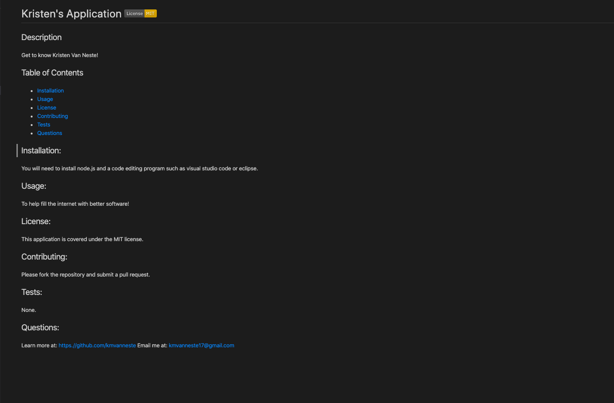

# README-Generator

## About
Are you exhausted from writing a README for all of your GitHub repositories?  Wish there was a simple solution for develping a professional README without looking up Markup syntax or looking at your old applications?  Now you can with the README-Generator!

## Usage
Follow the prompted questions in your terminal and bing bang boom you have a unique README that is perfect for your published application!

## Installation
You will need to download node.js in order for this program to work, as well as fork the index.js and generateMarkdown.js file.

## Appearance
Here is what the terminal will ask you as you run the program:
;

Here is an image of a finished README:
;